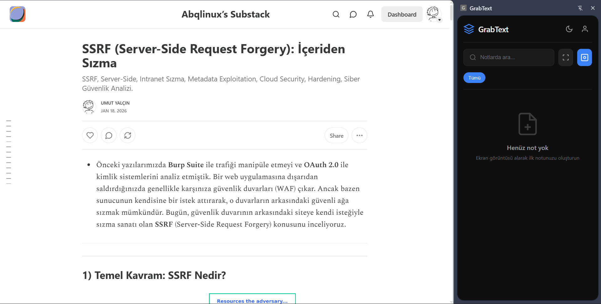
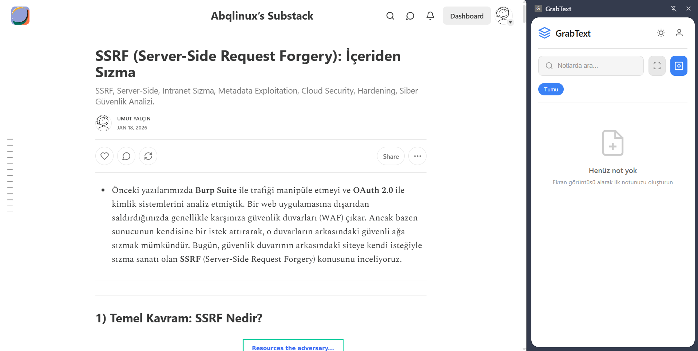
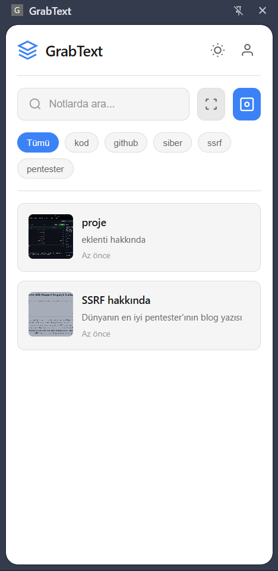
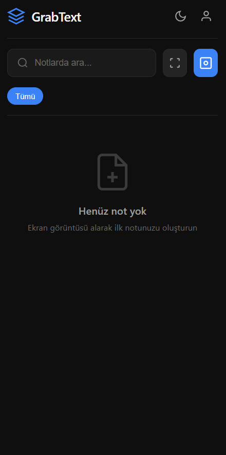
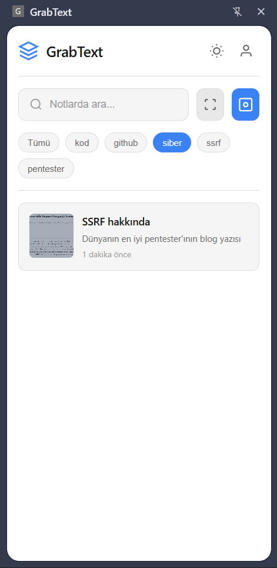
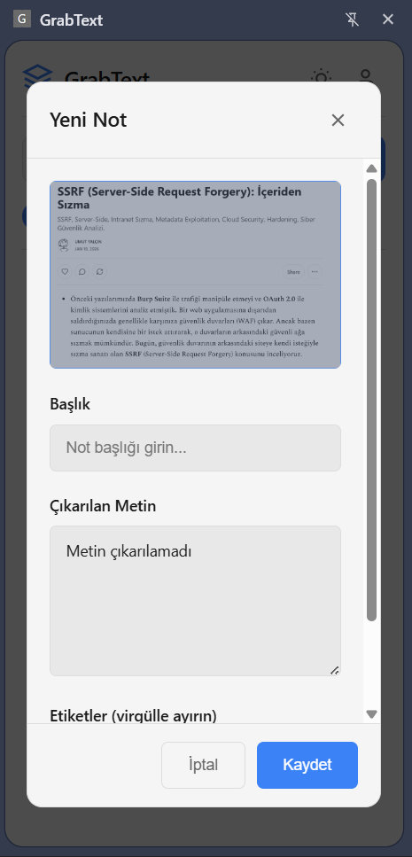
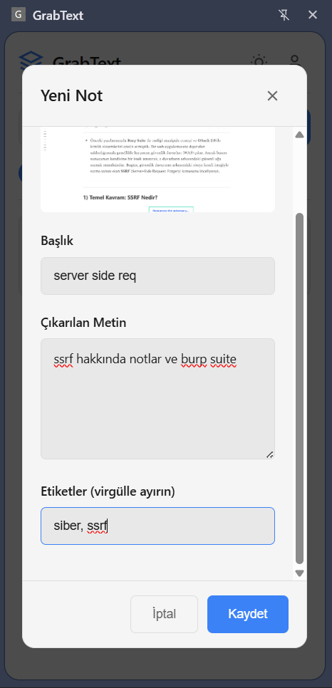

# Ekran Görüntülerini Kaydetmek ve Not Tutmak İçin Bir Google Eklentisi

 
    &nbsp;&nbsp; &nbsp;&nbsp; &nbsp;&nbsp; 

---

## Eklenti ile alakalı birkaç ekran görüntüsü / A few screenshots related to the extension

     
    
    
    
    
     
    
    

---

###🚀 Ekran Görüntülerinden Metin İle Not Alın: Tek Tıkla
Bu Chrome eklentisi ile ekran görüntülerinizdeki metinleri kolayca not haline getirin.

Tam Ekran Görüntüsü: Açık olan sayfanın tamamını yakalayın.
Alan Seçimi: Sadece istediğiniz bölgeyi seçerek kırpın.
Otomatik OCR: Görüntüdeki tüm metinler anında tanınır ve çıkarılır.
Bu eklenti, araştırma yaparken veya bilgi toplarken zamandan tasarruf etmenizi sağlıyor. Etiketleme ve arama özellikleriyle notlarınıza hızlıca ulaşabilirsiniz.

---

###🚀 Extract Text from Screenshots Instantly: One Click 
I'm building this Chrome extension to easily turn your screenshots into notes.

Full Screen Capture: Capture the entire visible page.
Area Selection: Select and crop only the region you need.
Automatic OCR: All text in the image is instantly recognized and extracted.
This extension helps you save time while researching or collecting information. With tagging and search features, you can quickly access your notes.

---

### 💻 Proje Teknolojileri: / Project Technologies:

    

💡 **Eklenecekler / To Be Added**: Chrome Extensions sayfasına eklenecek ve link readme. dosyasına eklenecek. Eğer Web sayfasına yüklenmeden kullanmak istiyorsanız gerekli konfigürasyon ayarları ile yerel bir şekilde kullanabilirsiniz.

---
