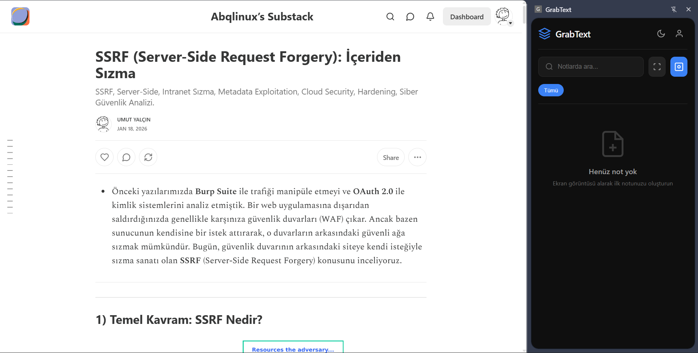
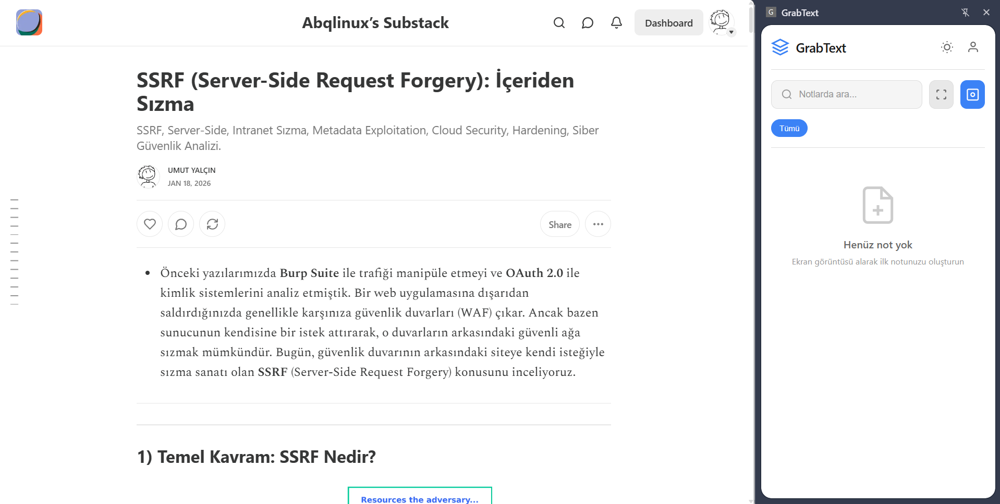
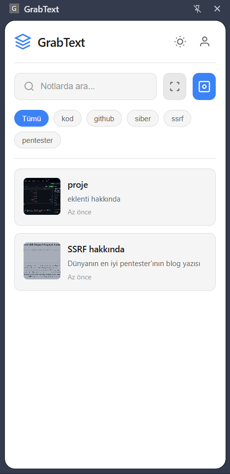
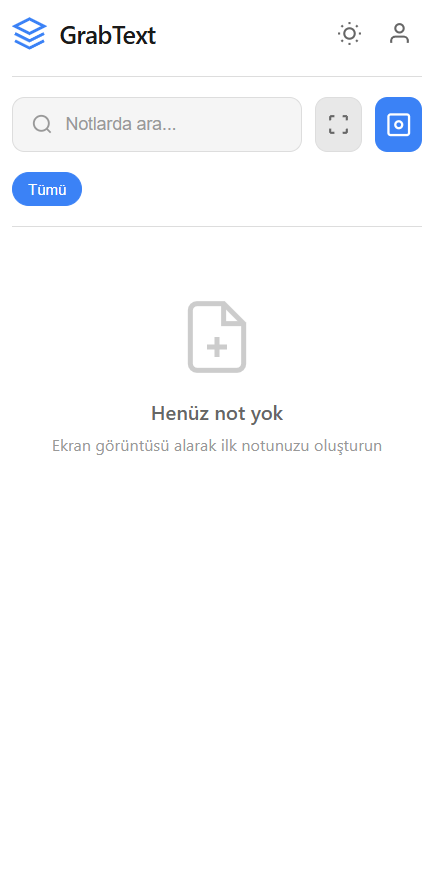
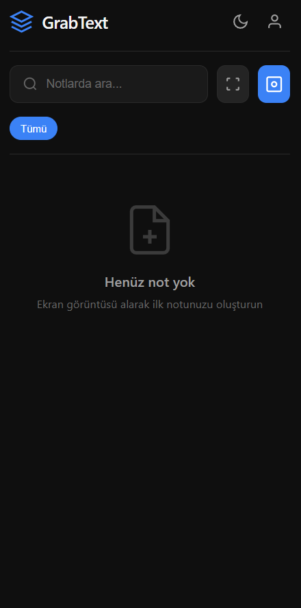
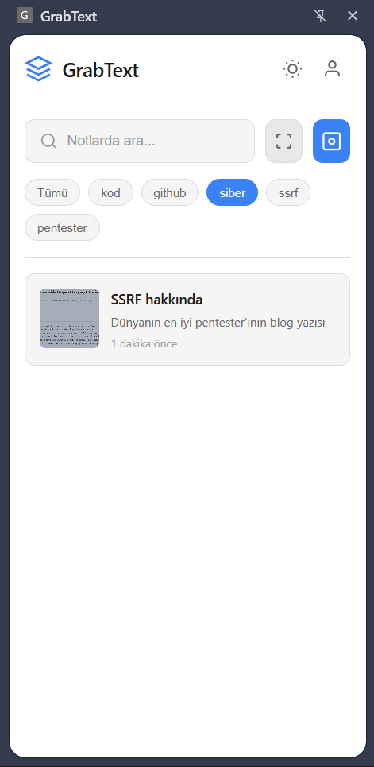
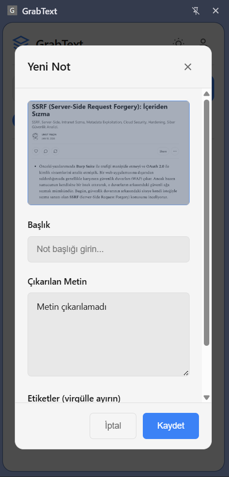
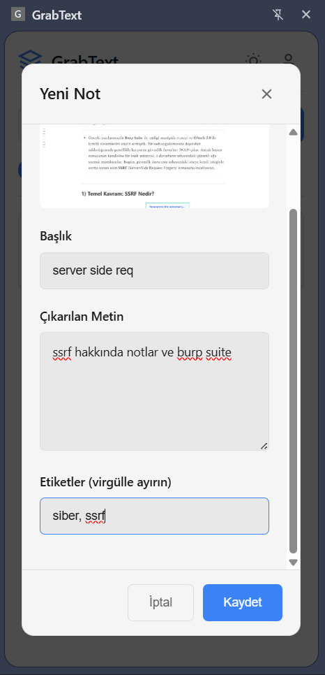

# Ekran Görüntülerini Kaydetmek ve Not Tutmak İçin Bir Google Chrome Eklentisi

    

---

## Eklenti ile alakalı birkaç ekran görüntüsü / A few screenshots related to the extension

     
    
    
    
    
     
    
    

---

### Ekran Görüntülerinden yazı ve görsel ile not alın
Bu eklenti ile birlikte ekran görüntülerinizi not alıp kaydedin

Ekran Görüntüsü, Açık olan sayfanın istediğiniz kısmının ekran görüntüsünü alabilirsiniz.

Otomatik OCR, Görüntüdeki tüm görseller ve metinler eksiksiz bir şekilde uygulanır.

Bu eklenti araştırma yaparken veya bilgi toplarken zamandan tasarruf etmenizi sağlar.. Etiketleme ve arama özellikleriyle notlarınıza hızlıca ulaşabilirsiniz.

---

### Take notes with text and images from screenshots
Take notes and save your screenshots with this extension

Screenshot, You can take a screenshot of any part of the open page you want.

Automatic OCR, All visuals and texts in the image are extracted completely.

This extension helps you save time while researching or collecting information. With tagging and search features, you can quickly access your notes.

---

### Proje Teknolojileri: / Project Technologies:

    </a>

**Eklenecekler / To Be Added**: Chrome Extensions sayfasına eklenecek ve link readme. dosyasına eklenecek. Eğer Web sayfasına yüklenmeden kullanmak istiyorsanız gerekli konfigürasyon ayarları ile yerel bir şekilde kullanabilirsiniz.

---

## Gizlilik Notu / Privacy Note

GrabText ile oluşturulan notlar, ekran görüntüleri, çıkarılan OCR metinleri ve etiketler tarayıcının yerel depolama alanında (`chrome.storage.local`) saklanır. Bu veriler harici bir sunucuya gönderilmez.

OCR işlemi yerel Tesseract.js dosyaları ile tarayıcı içinde çalışır. Dil verileri, ihtiyaç halinde Project Naptha'nın Tesseract veri kaynağından (`https://tessdata.projectnaptha.com`) yüklenebilir; bu işlem ekran görüntülerinin veya not içeriklerinin gönderildiği anlamına gelmez.

Notes, screenshots, extracted OCR text, and tags created with GrabText are stored in the browser's local extension storage (`chrome.storage.local`). This data is not sent to an external server.

OCR runs inside the browser using local Tesseract.js files. Language data may be loaded from Project Naptha's Tesseract data source (`https://tessdata.projectnaptha.com`) when needed; this does not mean screenshots or note contents are uploaded.
